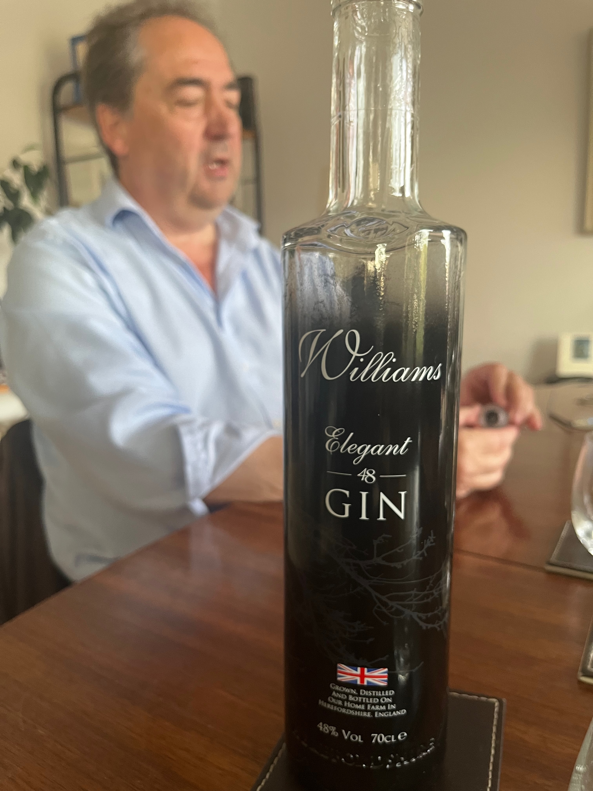
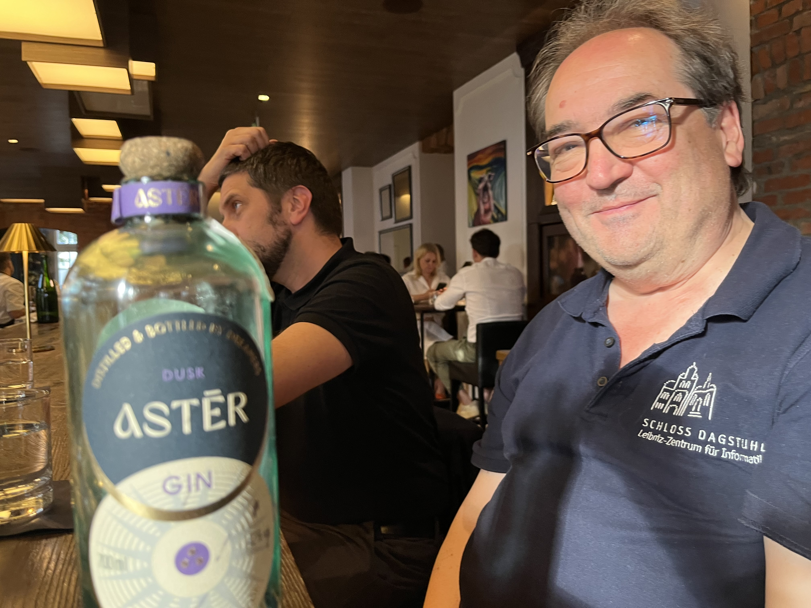

[comment]: # (
Compile with make %.slides.pdf
) 

---
title: |
       | On the existence and identification of a "best" gin  
       | A spirited exploration of conjoint measurement and social choice theory
subtitle: |
          | RyanFest 2025
          | Gdansk, Poland
author: Philip B. Stark
institute: University of California, Berkeley
date: 30 June 2025
classoption: "aspectratio=169"
theme: metropolis
colortheme: owl
themeoptions: background=dark 
header-includes:
    - \setbeamercolor{title separator}{fg=green}
    - \setbeamercolor{progress bar in section page}{fg=green}

---

::: columns
:::: column

::::
:::: column

::::
:::

---

## Peter and I have bonded over gin and "gineology." A few:

Anty Gin DK,
Aster PL,
The Botanist SC,
Brockman's EN,
Caorunn SC,
COIT US,
Conker EN,
Daffy's SC,
Drumshambo IE,
Few American US,
Empress US,
Fifty Pounds EN,
Fred Jerbis IT,
Gin Mare ES,
Greenhook US,
Heritage PL,
Le Gin FR,
Leopold's US,
Malfy IT,
Mikkeller DK,
Monkey 47 DE,
Napue FI,
Neversink US,
Nikka Coffee Still JP, 
Plymouth EN,
Roku JP,
Sea Stories PL,
St. George US,
Tanqueray SC,
Uncle Val's US,
Whitley Neill EN,
Williams Elegant EN,
Zymurgorium Manchester Marmalade EN

---

Genever: first mention 1200s, arose late 1500s,  
Old Tom in 1700s, London Dry in 1800s

---

1695–1735 London Gin Craze

1751 "drug crisis"

---

Typically 6-50 botanicals 

+ floral/herbal: lavender, rose, orange blossom, jasmine, honeysuckle, chamomile, 
basil, elderflower, heather, cornflower, fuchsia, hawthorn, hibiscus, clover,
cherry blossoms, orange blossoms, lime blossoms, violets, lily, tea, rosemary

+ citrus: lemon, lime, orange, blood orange, grapefruit, yuzu, kaffir lime  

+ other fruit: cucumber, rhubarb, tomato

+ evergreen: juniper, fir, spruce

+ seeds/roots/bark/stamen/pollen: coriander, cinnamon, cumin, anise, nutmeg, cardamom, saffron,
Szechuan pepper, black pepper, almond, licorice, wormwood, cassia, orris, cubeb, 
grains of paradise, ginger, acacia seeds, cacao, fennel, guarana, poppy, tonka bean

+ umami: seaweed, oysters, mushrooms, capers, reggiano, nuts

---

Style: genever, Old Tom, London Dry, contemporary/western, Plymouth, navy strength, aged, spiced, 
seasonal gins, local gins 

Base spirit: wheat, rye, barley, corn, grapes, apples, honey, ...

Processes: pot still, column still, maceration and/or steam extraction, cuts, aging (& barrel type)

Appearance: clear? colored? louche? legs? 

Nose

Palate: taste and mouth feel--unctuous? thin?

Finish: flavor, duration of lingering

ABV: 40-43, 44-50, Navy strength (57+)

---

---

Is there a "best" gin?

. . .

Set aside the issue of whether it’s to sip neat, drink with ice, make a martini, have with tonic, or make a Negroni   

. . .

Set aside personal differences: Is there a "best" gin in Peter's opinion?

---

::: columns
:::: column

::::
:::: column
Bistromathics: the math involved in splitting the bill at a bistro.  

Anything is possible.

. . .

\vspace{.5in}

Gineology: the math involved in defining and identifying a "best" gin.   

Nothing is possible.
::::
:::

---

## Can gins be ranked in a total order?

Total order $\le$ on a set $\mathcal{S}$:

Reflexive: $\forall s \in \mathcal{S}, \; s \le s$.

Transitive: if $s, t, u \in \mathcal{S}$ then $s \le t$ and $t \le u$ implies $s \le u$.

Antisymmetric: if $s, t \in \mathcal{S}$ then $s \le t$ and $t \le s$ implies $s=t$.

Totality: for $s, t \in \mathcal{S}$, either $s \le t$ or $t \le s$

(Without antisymmetry, "preorder")

---

## Reducing multidimensional measurements to a 1-D scale

Multidimensional rankings: conjoint measurement (Luce & Tukey, 1964), Plynomial conjoint measurement
(Tversky, 1967)

Illustrate with 2 attributes, juniper $J$ (low, middle, high) and other botanicals $B$
(floral forward, citrus forward, spice forward).

---

Single cancellation axiom:

Let  $b, c \in B$ and $j, k \in J$.

If $(b, j) \ge (c, j)$ for some $j \in J$, then $(b, k) \ge (c, k)$ for all $k \in J$;
and
if $(b, j) \ge (b, k)$ for some $b \in B$, then $(c, j) \ge (c, k)$ for all $c \in B$.

If you prefer more juniper in a floral gin, you **must** prefer more juniper in a citrus gin.

---

Double cancellation axiom:

If $(b, j) \ge (c, k)$ and $(c, \ell) > (d, j)$ then 
$(b, \ell) > (d, k)$.

If you like a floral gin with medium juniper more than you like a citrus gin
with low juniper and you like a citrus gin with high juniper more than you like
a spicy gin with medium juniper, then you **must** like a floral gin with high juniper
more than you like a spicy gin with medium juniper.

---

Even 1-d ranking can behave oddly:

Can you taste the same gin twice? Variability:
 
+ batch
+ temperature (& its influence on dilution)
+ mixer
+ weather, mood, time of day, food, ...

Intransitive gin?

---

---

---

Preference models:

Thurstonian

Random vector $\mathbf{Z} = (Z_1, \ldots, Z_n)$.

Item $i$ is preferred to item $j$ iff $Z_i > Z_j$

---

---

Multinomial logit

$$\Pr \{ R_j = k\} = \frac{e^{\boldsymbol{\beta}_k 
\cdot X_i }}{\sum_{j=1}^K e^{\boldsymbol{\beta}_j \cdot X_i}}.
$$

---

Rasch Rating Scale model

Special case of multinomial logit.

$$
\Pr\{X_{ni}=x\}={\frac {\exp 
{{\sum _{k=0}^{x}(\beta _{n}}-({\delta _{i}-\tau _{k}}))}}{\sum _{j=0}^{m}
\exp {{\sum _{k=0}^{j}(\beta _{n}}-{(\delta _{i}-\tau _{k}}))}}}
$$
where 
$\delta _{i}$ is the deliciousness of item $i$,
$\tau _{k}$ is the $k$th scale threshold,
$m$ is max score. 

$\tau _{0}$ set implicitly by the other values of $\tau_i$.

Special case of multinomial logit.

---

Let your senses vote? 

+ Approval gin?

+ Condorcet gin? Winner of majority of pairwise comparisons.

+ Ranked-choice gin?

---

## Arrow's Ginpossibility Theorem

Each of Peter's senses has an ordered set of gin preferences. 

. . .

Rule for choosing "best" gin is a function of those sensory preferences.

. . .

No single sense completely determines the choice.

. . .

Some set of sensory preferences could make any gin "best.""

. . .

Whether Peter prefers gin A to gin B depends only on gin A and gin B, not on gin C.

. . .

Bartender: "We have Tanqueray 10 and Hendricks."  
Peter: "Tanqueray 10, please."  
Bartender: "We also have Sipsmith."  
Peter: "In that case, I'd prefer the Hendricks."

. . .

Can't gin up such a rule.

---

## Duty-free tasting and shopping: the Secretary Problem

Can carry one bottle of gin through customs.

Will go through $N$ airports on your trip.

Can taste one gin in each duty free shop on your trip; can't go back. Buy or not?

Optimal strategy (for random permutation): taste $N/e$ gins, then buy the first 
that's at least as tasty as any you've had.

---

Algorithms to stock your bar

---

Recommendation engines:

+ Model empirical preferences as, say, multinomial regression.

+ Model empirical preferences using Conjoint Analysis (but do the assumptions hold?)

+ LLMs?

---

`My friend Peter likes London Dry Gin. 
He prefers a balanced gin, not juniper-forward. He likes both citrus and
floral notes, but prefers citrus.
He sometimes drinks his gin with tonic and sometimes neat. 
I've never seen him order any other gin cocktail.
His favorite readily available gin is Tanqueray 10. He also likes Monkey 47,
Caorunn, Chase Elegant English Gin, and Zymurgorium Manchester Marmalade Gin.
He is not fond of Navy Strength gin. And he finds Nikka and Roku too bitter.

Please recommend three gins Peter is unlikely to have tried, one from eastern Europe, 
one from southern Europe,
and one omakase, and recommend whether to drink the omakase choice neat or with tonic.`

---

| LLM | Eastern Europe | Southern Europe | Omakase |
|:-----|:------|:-----|:-----|
| Ginini Pro | Baczewski | Gin Mare | Ferdinand's Saar |
|            | Poland                | Spain |    Germany |
|            |                         |        | neat |
| GinGPT | Little Urban Distillery | Malfy Gin Con Limone  | Procera Blue Dot Gin |
|        | Czech Republic             | Italy    | Kenya |
|        |                     |          | neat | 

---

Ginini Pro

Peter sounds like he has a sophisticated palate for gin! He appreciates balance, prefers citrus over juniper-forward profiles, and enjoys both citrus and floral notes. His fondness for Tanqueray 10, Monkey 47, Caorunn, Chase Elegant English Gin, and Zymurgorium Manchester Marmalade Gin, along with his aversion to Navy Strength, Nikka, and Roku (due to bitterness), gives us a good roadmap.

Here are three recommendations, keeping in mind gins he's unlikely to have tried:

---

Eastern Europe: Baczewski Gin (Poland)

Why it fits Peter: Baczewski Gin, from Poland, is a classic London Dry style but often described as well-balanced, with a good interplay of botanicals. While it does have juniper, it's not overwhelmingly forward. It tends to feature prominent citrus notes (often lemon and orange peel) and subtle floral or herbal undertones, fitting Peter's preference for citrus over floral but still appreciating both. It's less common than many Western European gins, so Peter is likely to not have encountered it.

Flavor Profile: Expect a clean, crisp gin with bright citrus and a gentle herbaceousness, along with the classic juniper backbone that is balanced rather than dominant.

Why he'll like it: It shares a similar approachable London Dry profile with Tanqueray 10, but with its own distinct Eastern European character. The citrus focus should appeal to him, and it's not known for bitterness.

---

Southern Europe: Gin Mare (Spain)

Why it fits Peter: Hailing from Spain, Gin Mare is a prime example of a contemporary Mediterranean gin. It's famous for its savory and aromatic profile, utilizing botanicals like Arbequina olives, rosemary, thyme, and basil, alongside more traditional juniper and citrus. While it's not explicitly "floral," its herbal notes can often provide a similar aromatic complexity that would appeal to someone who enjoys floral gins, while the robust citrus presence (especially orange peel) is very strong. It's widely available in some regions but still unique enough that many gin enthusiasts haven't tried it.

Flavor Profile: Savory, aromatic, with distinct olive and herbal notes complemented by a clear burst of citrus. It's incredibly smooth.

Why he'll like it: This gin offers a completely different, yet still balanced, experience from his current favorites. The strong citrus element, combined with unique Mediterranean botanicals, should intrigue him without being overly juniper-forward or bitter. It's a departure but within his preferred flavor wheelhouse.

---

Omakase Choice: Ferdinand's Saar Dry Gin (Germany)

Why it fits Peter: While Germany is technically Central Europe, Ferdinand's Saar Dry Gin offers a truly unique and sophisticated profile that fits the "omakase" (chef's choice) criteria. It's distilled with Riesling grapes from the Saar region, which imparts a subtle fruitiness and a delicate, almost floral, sweetness. It's far from juniper-dominant and beautifully balances citrus (often lime and lemon) with a range of floral and herbal botanicals, including lavender and rose. This gin is known for its elegance and complexity.

Flavor Profile: Delicate, aromatic, with prominent citrus and floral notes, a subtle grape sweetness, and a smooth, refined finish. It's very well-integrated and not bitter.

Drink Recommendation for Ferdinand's Saar Dry Gin: Neat. This gin is crafted with such care and has such a nuanced, delicate flavor profile that adding tonic, while not necessarily bad, could easily overpower its subtle complexities. Peter appreciates drinking gin neat sometimes, and Ferdinand's is an excellent candidate for this. Encourage him to try it neat first, perhaps with a single large ice cube and a lemon peel twist to highlight its citrus. If he insists on tonic, a very light, high-quality tonic with a minimal amount of sugar would be best, to allow the gin to still shine.

---

GinGPT

Thanks for the detailed profile — that helps a lot. Based on Peter's preferences (balanced rather than juniper-heavy, citrus-leaning, floral-friendly, no harsh bitterness, and aversion to overproof gins), here are three gins he’s unlikely to have tried, each fitting your regional request and taste profile:

---

Eastern Europe:  
Little Urban Distillery Gin (Czech Republic)

Profile: This small-batch gin from Prague is beautifully balanced, with a citrus-forward palate (lemon zest and grapefruit) and delicate herbaceous and floral layers.

Why it fits: It's a refined London Dry style without the aggressive juniper hit. It has the elegance and balance Peter seems to appreciate in Caorunn and Tanqueray 10.

Try it: Neat or with a light Mediterranean tonic and a lemon twist.

---

Southern Europe:  
Malfy Gin Con Limone (Italy)

Profile: Distilled with Italian lemons from the Amalfi Coast and juniper, this gin is sunshine in a glass — zesty, crisp, and soft on the palate.

Why it fits: Heavy on citrus but not synthetic or overpowering, it bridges the gap between craft and accessibility. Think Tanqueray 10’s citrus with a lighter, more playful tone.

Try it: With tonic — preferably Fever-Tree Light or a rosemary tonic — and a lemon peel.

---

Omakase Pick:  
Procera Blue Dot Gin (Kenya)

Profile: Made with African juniper and botanicals sourced across the continent, this ultra-premium gin is complex, citrus-forward (think fresh lime leaf), with soft spice and a creamy, almost nutty finish.

Why it fits: It’s not bitter or harsh, beautifully distilled, and strikes a similar "elegant but expressive" note like Monkey 47 or Chase Elegant.

Try it: Neat — served slightly chilled to highlight its layered flavor and smooth texture.
