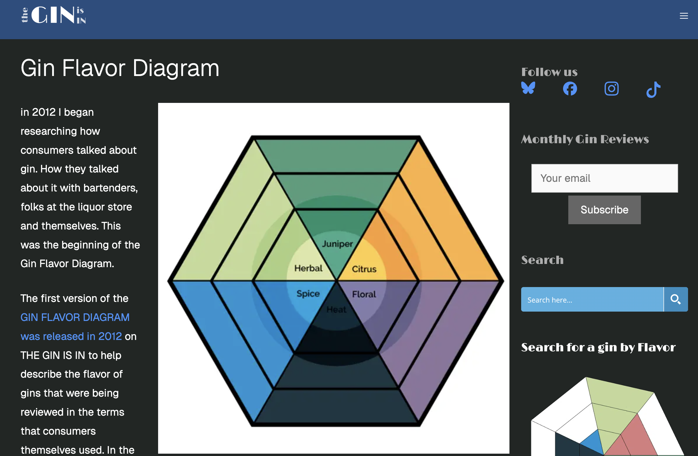
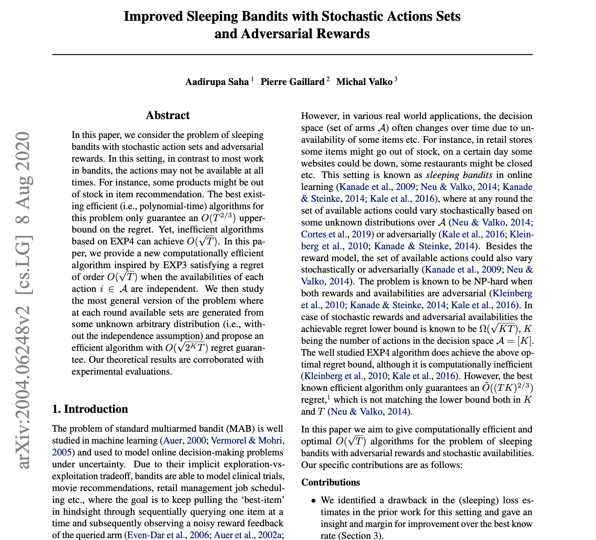

[comment]: # (
Compile with make %.slides.pdf
) 

---
title: |
       | On the existence and identification of a "best" gin  
       | A spirited exploration of conjoint measurement and social choice theory
subtitle: |
          | Ryan Fest 2025
          | Gdansk, Poland
author: Philip B. Stark
institute: University of California, Berkeley
date: 30 June 2025
classoption: "aspectratio=169"
theme: metropolis
colortheme: owl
themeoptions: background=dark 
header-includes:
    - \setbeamercolor{title separator}{fg=green}
    - \setbeamercolor{progress bar in section page}{fg=green}

---

## Peter and I have bonded over gin and "gineology." A few:

::: columns
:::: column 
Anty Gin DK   
The Botanist SC  
Brockman's EN  
Caorunn SC  
COIT US  
Conker EN
Daffy's SC  
Drumshambo IE  
Few American US  
::::
:::: column  
Empress US 
Fifty Pounds EN  
Fred Jerbis IT  
Gin Mare ES    
Greenhook US  
Le Gin FR   
Leopold's US  
Malfy IT      
Mikkeller DK  
::::
:::: column
Monkey 47 DE   
Napue FI  
Neversink US  
Nikka Coffee Still JP   
Plymouth EN  
Roku JP  
St. George US  
Tanqueray SC  
Uncle Val's US  
Whitley Neill EN    
Zymurgorium Manchester Marmalade EN  
::::
:::

---

Genever: first mention 1200s, arose late 1500s,  
Old Tom in 1700s, then London Dry in 1800s

---

1695–1735 London Gin Craze

1751 "drug crisis"

---

Base spirit: wheat, rye, barley, corn, grapes, apples, honey, ...

Style: genever, Old Tom, London Dry, contemporary/western, Plymouth, navy strength, aged, spiced 

---

Typically 6-50 botanicals 

+ floral/herbal: lavender, rose, orange blossom, jasmine, honeysuckle, chamomile, 
basil, elderflower, heather, cornflower, fuchsia, hawthorn, hibiscus, clover,
cherry blossoms, orange blossoms, lime blossoms, violets, lily, tea, rosemary

+ citrus: lemon, lime, orange, blood orange, grapefruit, yuzu, kaffir lime, 

+ other fruit: cucumber, rhubarb, tomato

+ evergreen: juniper, fir, spruce

+ seeds/roots/bark/stamen: coriander, cinnamon, cumin, anise, nutmeg, cardamom, saffron,
Szechuan pepper, black pepper, almond, licorice, wormwood, cassia, orris, cubeb, 
grains of paradise, ginger, acacia seeds, cacao, fennel, guarana, poppy, tonka bean

+ umami: seaweed, oysters, mushrooms, capers, reggiano, nuts

---

Aged? Type of barrel? 

Appearance: clear? Colored? louche? Legs? 

Nose

Palate (taste and mouth feel—unctuous? Thin?)

Finish (flavor, lingering)

ABV: 40-43, 44-50, Navy strength (57+)

---

Processes: 

Pot still, column still, maceration, sack in pot, sack in column, cuts, aging

Seasonal gins, local gins

---

---

Is there a "best" gin?

. . .

Set aside the issue of whether it’s to sip neat, drink with ice, make a martini, have with tonic, or make a Negroni   

. . .

Set aside personal differences: Is there a "best" gin in Peter's opinion?

---

## Can gins be ranked in a total order?

Total order $\le$ on a set $\mathcal{S}$:

Reflexive: $\forall s \in \mathcal{S}, \; s \le s$.

Transitive: if $s, t, u \in \mathcal{S}$ then $s \le t$ and $t \le u$ implies $s \le u$.

Antisymmetric: if $s, t \in \mathcal{S}$ then $s \le t$ and $t \le s$ implies $s=t$.

Totality: for $s, t \in \mathcal{S}$, either $s \le t$ or $t \le s$

---

## Reducing multidimensional measurements to a 1-D scale

Multidimensional rankings: conjoint analysis

Illustrate with 2 attributes, juniper $J$ (low, middle, high) and other botanicals $B$
(floral forward, citrus forward, spice forward).

---

Single cancellation axiom:

Let  $b, c \in B$ and $j, k \in J$.

If $(b, j) \ge (c, j)$ for some $j \in J$, then $(b, k) \ge (c, k)$ for all $k \in J$;
and
if $(b, j) \ge (b, k)$ for some $b \in B$, then $(c, j) \ge (c, k)$ for all $c \in B$.

---

Double cancellation axiom:

Tversky (1967) Polynomial conjoint measurement

---

---

Even 1-d ranking can behave oddly:

Can you taste the same gin twice? Variability:
 
+ batch
+ temperature
+ mixer
+ weather, mood, time of day, food, ...

Intransitive gin?

---

---

---

Preference models:

Multinomial logit

$$\Pr \{ R_j = k\} = \frac{e^{\boldsymbol{\beta}_k 
\cdot X_i }}{\sum_{j=1}^K e^{\boldsymbol{\beta}_j \cdot X_i}}.
$$

---

Thurstonian ranking model

$m$ items ranked by $n$ judges. 

"latent variables" 

---

Rasch "Rating Scale" model:

$$
\Pr\{X_{ni}=x\}={\frac {\exp 
{{\sum _{k=0}^{x}(\beta _{n}}-({\delta _{i}-\tau _{k}}))}}{\sum _{j=0}^{m}
\exp {{\sum _{k=0}^{j}(\beta _{n}}-{(\delta _{i}-\tau _{k}}))}}}
$$
where 
$\delta _{i}$ is the deliciousness of item $i$ and 
$\tau _{k}$ is the $k$th threshold location of the rating 
scale which is in common to all the items. 
$m$ is the maximum score 
and is identical for all the items. 

$\tau _{0}$ set implicitly by the other values of $\tau_i$.

Special case of multinomial logit.

---

---

Let your senses vote? 

+ Approval gin?

+ Condorcet gin? Winner of majority of pairwise comparisons.

+ Ranked-choice gin?

---

## Arrow's Ginpossibility Theorem

Each of Peter's senses has an ordered set of gin preferences. 

. . .

Rule for choosing gin is a function of those sensory preferences.

. . .

No single sense completely determines the choice.

. . .

There is some set of sensory preferences that could make any gin "best" according
to the chosen function.

. . .

Whether Peter prefers gin A to gin B depends only on gin A and gin B, not on gin C.

Bartender: "We have Tanqueray 10 and Hendricks."  
Peter: "I'll have Tanqueray 10."  
Bartender: "We also have Sipsmith."  
Peter: "In that case, give me the Hendricks."

. . .

Can't gin up such a rule.

---

## Duty-free tasting and shopping: the Secretary Problem

Can carry one bottle of gin through customs.

Will go through $N$ airports on your trip.

Can taste one gin in each duty free shop on your trip; can't go back. Buy or not?

Optimal strategy (for random permutation): taste $N/e$ gins, then buy the first 
that's at least as tasty as any you've had.

---

Algorithms to stock your bar

---

Recommendation engines:

+ Model empirical preferences as, say, multinomial regression.

+ Conjoint analysis.

---

`My friend Peter likes London Dry Gin. 
He prefers a balanced gin, not juniper-forward. He likes both citrus and
floral notes, but prefers citrus.
He sometimes drinks his gin with tonic and sometimes neat. 
I've never seen him order any other gin cocktail.
His favorite readily available gin is Tanqueray 10. He also likes The Botanist,
Chase Elegant English Gin, and Zymurgorium Manchester Marmalade Gin.
He is not fond of Navy Strength gin. And he finds Nikka and Roku too bitter.

Please recommend three gins Peter is unlikely to have tried, one from eastern Europe, 
one from southern Europe,
and one omakase, and recommend whether to drink the omakase choice neat or with tonic.`

---

| LLM | Eastern Europe | Southern Europe | Omakase |
|:-----|:------|:-----|:-----|
| Ginini Pro | Heritage Gin | Gin Raw | Four Pillars Rare Dry |
|            | Slovenia                | Spain |    Australia |
|            |                         |        | start neat then make G&T |
| GinGPT | Ólafsson Icelandic Gin | Malfy Gin Con Limone  | Procera Blue Dot Gin |
|        | Iceland             | Italy    | Kenya |
|        |                     |          | neat | 

---

Ginini Pro

Of course. This is a fantastic and detailed profile of Peter's palate.
It's clear he appreciates a modern, sophisticated gin that showcases craftsmanship 
beyond just juniper. 
The key is balance, with a strong preference for bright, fresh citrus over 
bitter or overtly herbal notes.
Here are three recommendations he is unlikely to have tried, designed to 
perfectly match his tastes.

---

Eastern European Choice: Heritage Gin (Slovenia)

Why Peter will love it: This gin from the Karst region of Slovenia is a beautiful 
bridge between the floral notes he enjoys in The Botanist and the classic structure he 
likes in a London Dry. It’s an homage to the region's long history of distilling local 
juniper (Brinovec), but it is refined into a contemporary, balanced gin. 
It is absolutely not a juniper-forward gin.

The Flavor Profile: The standout botanicals are linden flowers and rosehip, which 
provide a delicate, honeyed floral sweetness. This is supported by classic notes of coriander and a subtle, soft citrus backbone. It’s exceptionally smooth and elegant, complex without being overwhelming. It shares a certain wild-foraged, terroir-driven character with The Botanist, but with a completely unique Eastern European profile.
Why he's unlikely to have tried it: Slovenian gin is far from mainstream and 
requires a visit to a specialty store or online retailer. 
It's a true discovery bottle for someone who appreciates regional craft.

---

Southern European Choice: Gin Raw (Spain)

Why Peter will love it: Hailing from Barcelona, a hotspot of gin innovation, 
Gin Raw is the perfect Southern European pick for a Tanqueray 10 lover.
The distillers' goal was to create a superior gastronomic gin. 
Like Tanqueray 10, its magic comes from using fresh, vibrant botanicals rather than 
just dried ones. It specifically caters to a palate that enjoys bright citrus but 
finds gins like Roku and Nikka too bitter.

The Flavor Profile: Gin Raw uses a low-temperature distillation process to capture the truest essence of its fresh Mediterranean and exotic botanicals. It leads with a chorus of bright citrus—lemon, citron, and kaffir lime leaf—that is zesty and fresh, not sharp or pithy. This is layered over a subtle herbal base of bay leaf with a hint of spice from black cardamom. It’s sophisticated, exceptionally well-balanced, and has that vibrant "pop" that Peter clearly enjoys.
Why he's unlikely to have tried it: While Spain's Gin Mare is quite popular, Gin Raw remains more of a bartender's secret and a niche, high-end choice. It's a significant step up in craft and price from the usual suspects and isn't widely distributed.

---

Omakase Choice: Four Pillars Rare Dry Gin (Australia)

This is my "chef's choice," selected to be a potential new favorite for Peter. 
It comes from the Yarra Valley in Australia, a distillery that has rapidly become one 
of the most awarded and respected in the world.

Why it's the perfect Omakase pick: This gin is practically tailor-made for Peter's palate. 
It directly mirrors his favorite aspect of Tanqueray 10—the use of whole fresh 
citrus—by using whole, fresh, organic Australian oranges in the distillation. 
This gives it an incredibly aromatic and juicy Mediterranean-style citrus character. 
It has the complexity of The Botanist thanks to unique native botanicals like 
Tasmanian pepperberry and lemon myrtle, but the end result is a perfectly 
harmonious gin where the bright orange citrus is the star. 
It's contemporary, balanced, and a world away from the gins he dislikes.

The Flavor Profile: A wave of bright, sweet orange on the nose and palate, 
followed by a warm, soft spice from the pepperberry and a hint of lemon sherbet 
from the lemon myrtle. 
The juniper is present but acts as a perfect, gentle piney anchor for the other 
botanicals to shine. It's a modern classic.

---

How to Drink It: Start Neat, then make a G&T.

Neat: This gin is so beautifully crafted and aromatic that he absolutely must 
try it neat first, perhaps with one large ice cube to slightly chill and dilute it. 
This will allow him to appreciate the incredible aroma of the whole oranges and the 
subtle complexity of the Australian botanicals. 
It's smooth enough to be a delightful sipping experience.

With Tonic: This is where the gin truly sings and will likely become his go-to 
preparation for it. Use a high-quality, neutral tonic (like Fever-Tree Indian Tonic) 
so as not to mask the gin's botanicals. 
The carbonation will lift the orange notes, making for an exceptionally bright and 
refreshing G&T. 

The crucial instruction: garnish with a thick slice of fresh orange, not lime or lemon. 
This complements the gin's star botanical and completes the experience.

---

GinGPT

Peter’s taste is clearly refined and leans toward elegant, citrus-forward gins 
with balance and subtlety. Based on what he enjoys (like Tanqueray 10, The Botanist, 
and Chase Elegant), he favors premium gins with layered botanical character but 
without overwhelming bitterness or high proof.

Here are three thoughtful recommendations tailored to his profile, keeping in mind 
rarity and regionality:

---

Eastern Europe:
Ólafsson Icelandic Gin (Iceland)

Why it fits: While Iceland isn't traditionally known for gin, 
Ólafsson offers a beautifully smooth and citrusy profile, using local botanicals 
like Arctic thyme and birch. 
It's well-rounded, delicate, and not juniper-forward. 
The citrus is fresh rather than pithy or bitter, and it carries subtle floral notes.

Why Peter might like it: It's elegant and complex without being aggressive. 
Likely under the radar and not something he’s stumbled across unless he’s 
explored niche bars or traveled in Scandinavia.

---

Southern Europe:
Malfy Gin Con Limone (Italy)

Why it fits: Malfy’s Con Limone is bursting with Amalfi Coast lemon zest. 
It leans very citrus-forward but still carries the botanical structure of a London Dry. 
It's smooth, bright, and not bitter—perfect for warm weather or as a refreshing gin 
neat or with tonic.

Why Peter might like it: Think of this as a gin cousin to Zymurgorium Marmalade 
Gin—sunny, clean, and fruit-forward, but with a classic dry-gin spine. 
It’s a joyful and accessible Mediterranean-style gin with sophistication.

---

Omakase:
Procera Blue Dot Gin (Kenya)

Tasting profile: Made in Nairobi, using rare African juniper (Juniperus procera) 
and local botanicals like Swahili limes, pink peppercorns, and cardamom, this gin is 
vivid, citrusy, and slightly earthy—without bitterness or cloying juniper. 
Aged in glass, it’s pristine and ultra-smooth.

Recommended serve: Neat, ideally slightly chilled or with a single cube. 
Its complexity unfolds beautifully without tonic, much like how Peter enjoys 
the more premium gins.

Why it fits: This is a world-class, small-batch gin with character and finesse. 
It's unlike anything from the UK or Japan. Given that Peter enjoys neat sipping and appreciates citrus without overpowering bite, this is a rare and remarkable bottle that would likely impress him.
Let me know if you want a recommendation for a tonic or garnish to pair with 
any of these—especially for the Malfy. 
Or if Peter leans toward a particular type of citrus (lemon vs. grapefruit vs. orange), 
we can fine-tune even further.

